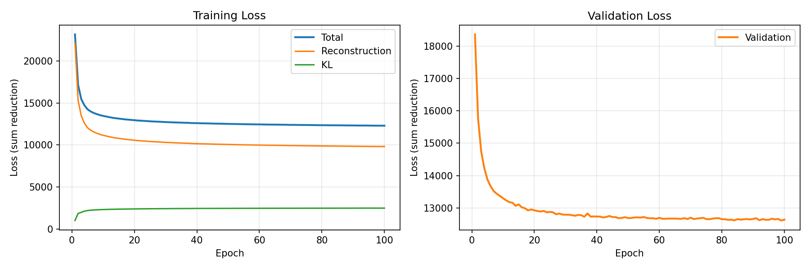
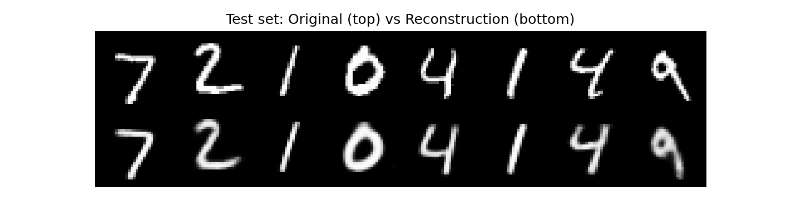
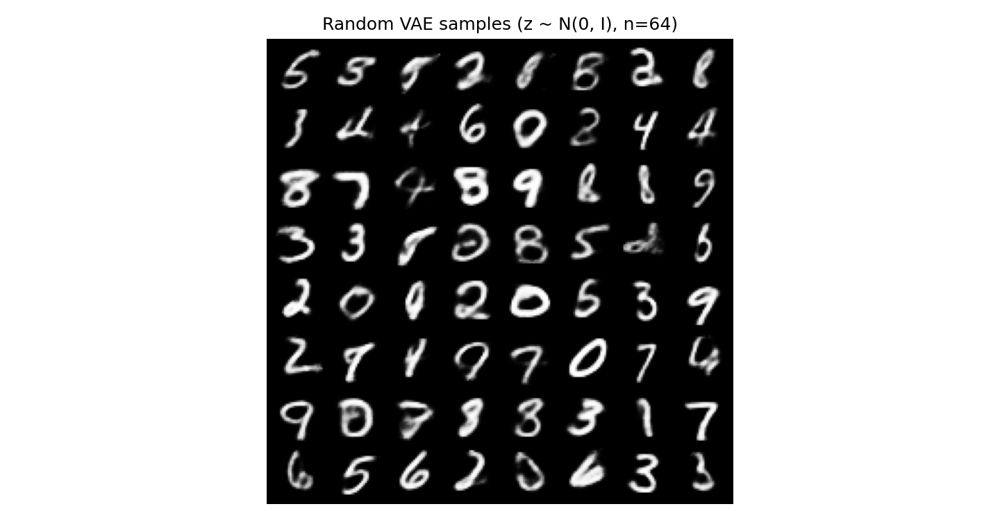
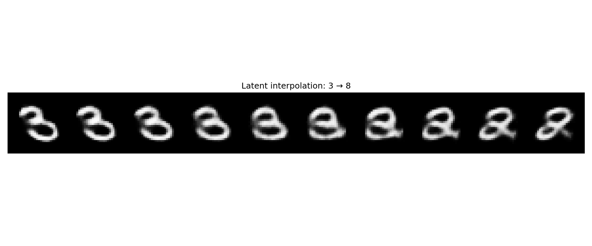
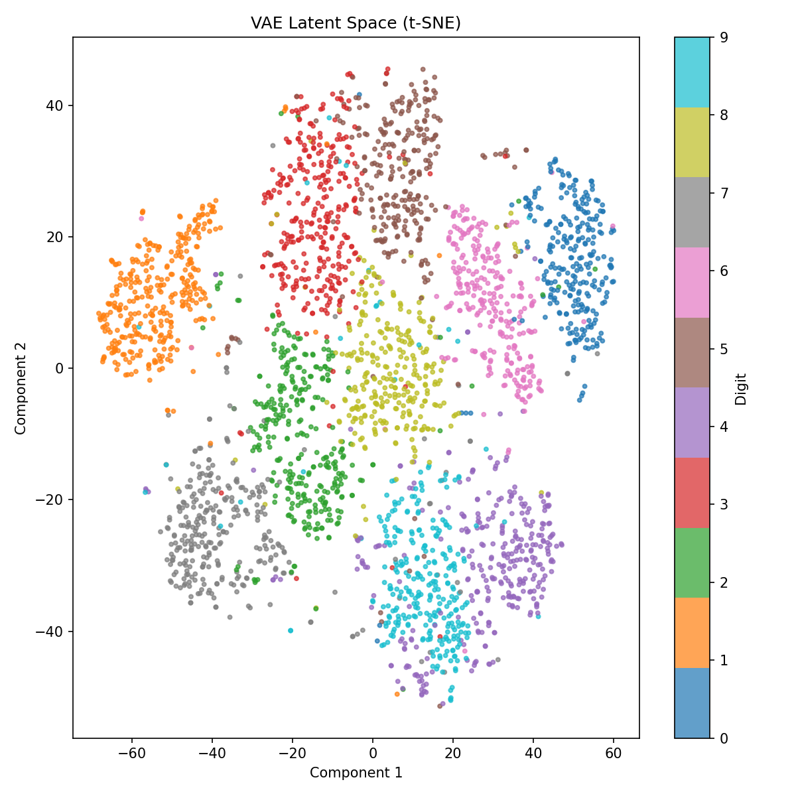
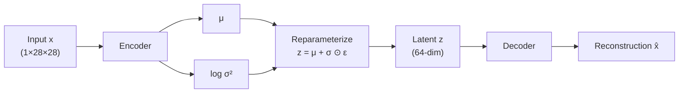

# generative-models

PyTorch implementations of generative models from scratch.

This repository currently includes a complete **MLP Variational Autoencoder (VAE)** on MNIST — from dataset pipeline and model components through training, logging, checkpointing, and evaluation experiments. A DDPM implementation is planned next, reusing the same engineering patterns.

---

## VAE results (MNIST, 100 epochs)

| Setting | Value |
|---------|-------|
| Architecture | MLP encoder / decoder |
| Latent dim | 64 |
| Hidden dim | 512 |
| Loss | BCE (sum) + KL (sum) |
| Optimizer | Adam, lr = 1e-3 |
| Batch size | 128 |

### Training curves



Metrics are logged to CSV after every epoch (`outputs/vae/logs/train_metrics_sum.csv`).

### Test-set reconstructions

Encoder → reparameterization → decoder on held-out digits:



### Random samples

New digits generated from the prior `z ~ N(0, I)` — no input image required:



### Latent interpolation

Linear interpolation between latent means of digits **3** and **8**:



### Latent space (t-SNE)

2D projection of encoder means `μ` for 3,000 test images — digits form meaningful clusters:



See also [PCA plot](docs/assets/vae/latent_space_pca.png) and [50 vs 100 epoch comparison](docs/assets/vae/epoch_comparison.md).

---

## Architecture

### VAE forward pass



### Encoder (modular)

```
784 → 512 → 256 → μ (64)
                  → log σ² (64)
```

### Decoder (symmetric)

```
64 → 256 → 512 → 784 → Sigmoid → (1×28×28)
```

### Loss (ELBO)

```
L = reconstruction_loss + kl_loss
```

Both terms use **sum reduction** so reconstruction and KL stay on comparable scales during training.

---

## Quick start

### Setup

```bash
python -m venv .venv
.venv\Scripts\activate        # Windows
# source .venv/bin/activate   # macOS / Linux

pip install -r requirements.txt
pip install -e ".[dev]"
```

### Train

```bash
# Sanity check (1 epoch)
python scripts/train_vae.py --epochs 1

# Full training (50 epochs)
python scripts/train_vae.py --epochs 50

# Resume to 100 epochs
python scripts/train_vae.py --resume outputs/vae/checkpoints/checkpoint_epoch_050.pt --epochs 100
```

### Experiments

```bash
# Random sampling
python scripts/sample_vae.py --checkpoint outputs/vae/checkpoints/vae_epoch100.pt --seed 42

# Test-set reconstruction grid
python scripts/reconstruct_vae.py

# Latent interpolation (3 → 8)
python scripts/interpolate_vae.py --digit-a 3 --digit-b 8

# Latent space visualization (PCA + t-SNE)
python scripts/visualize_latent_vae.py --max-samples 3000

# Training curves
python scripts/plot_training_curves.py

# Copy figures into docs/assets/vae/ for the README
python scripts/export_readme_assets.py
```

### Tests

```bash
pytest
```

---

## Project structure

```
generative-models/
├── configs/vae/          # Experiment configs (YAML)
├── data/raw/             # MNIST download location
├── docs/assets/vae/      # README figures (tracked in git)
├── outputs/vae/          # Checkpoints, logs, samples, figures (gitignored)
├── scripts/              # Training and experiment entry points
├── src/generative_models/
│   ├── datasets/         # MNIST dataloaders
│   ├── models/           # VAE (Encoder, Decoder, VAE)
│   ├── losses/           # VAELoss
│   ├── trainers/         # VAETrainer
│   ├── evaluation/       # Sampling, reconstruction, interpolation, viz
│   └── diffusion/        # (planned) DDPM
└── tests/
```

---

## Engineering patterns

| Pattern | Location |
|---------|----------|
| Config-driven experiments | `configs/vae/mnist.yaml` |
| Modular model components | `src/generative_models/models/vae.py` |
| Separate loss module | `src/generative_models/losses/vae_loss.py` |
| Reusable trainer | `src/generative_models/trainers/vae_trainer.py` |
| CSV metric logging | `outputs/vae/logs/` |
| Checkpointing + resume | `outputs/vae/checkpoints/` |
| Evaluation scripts | `scripts/sample_vae.py`, etc. |

These patterns will carry over directly to the DDPM implementation.

---

## Research note: posterior collapse fix

Early training used `BCE(reduction="mean")` with `KL = mean(sum(...))`, which made the KL term ~100,000× smaller than expected. The encoder collapsed to `μ ≈ 0, σ ≈ 1` and the decoder ignored the latent code.

**Fix:** switch both terms to **sum reduction** (Pattern A). KL became ~1,000–2,500, reconstructions improved immediately, and random samples became diverse recognizable digits.

---

## Roadmap

**VAE (complete)**

- [x] Dataset pipeline
- [x] Encoder / decoder / reparameterization
- [x] VAE loss and trainer
- [x] CSV logging and checkpointing
- [x] Random sampling
- [x] Reconstruction, interpolation, latent visualization
- [x] 50 vs 100 epoch controlled experiment

**Next: DDPM**

- [ ] Noise schedule and forward diffusion
- [ ] U-Net denoiser
- [ ] DDPM loss and trainer (reusing existing patterns)
- [ ] Sampling loop and evaluation

---

## License

See [LICENSE](LICENSE).
