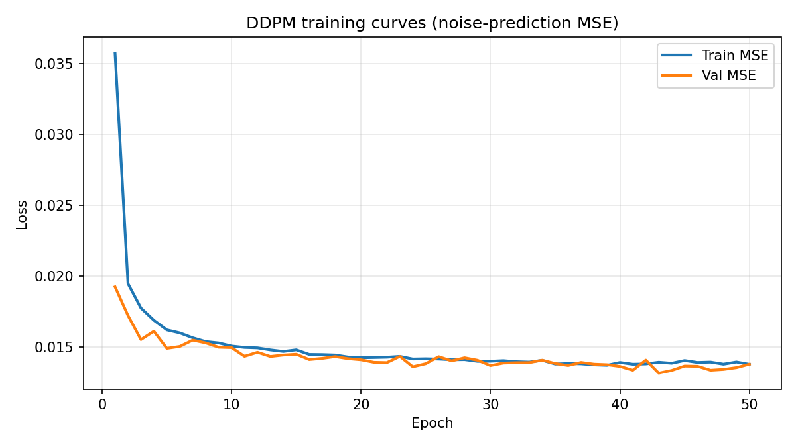
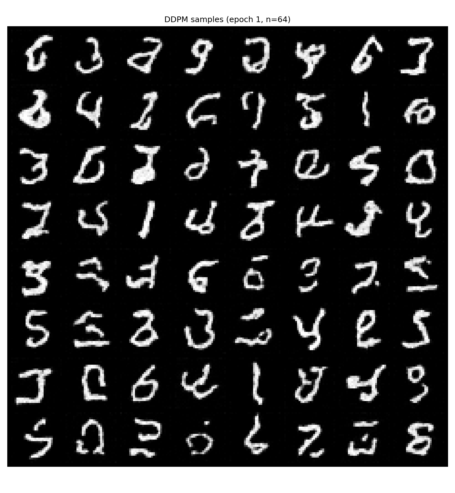
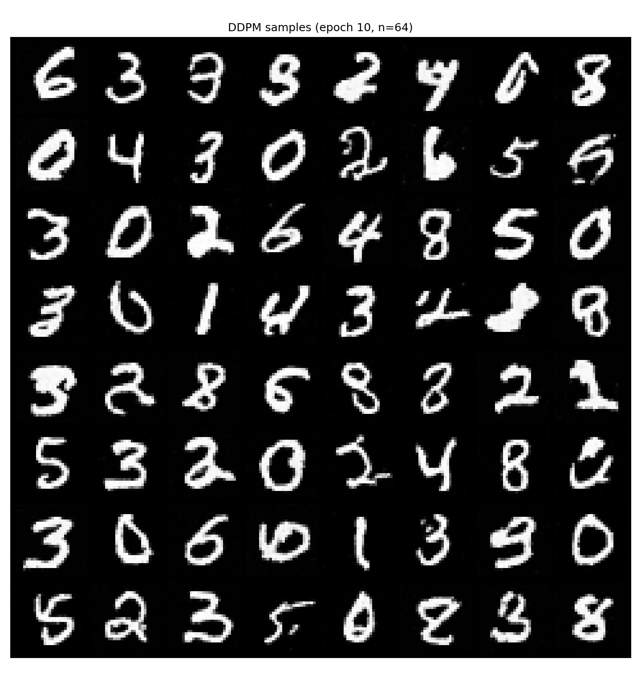
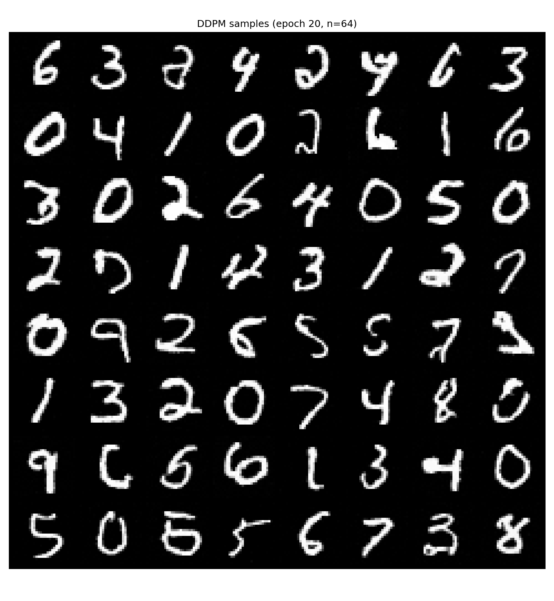
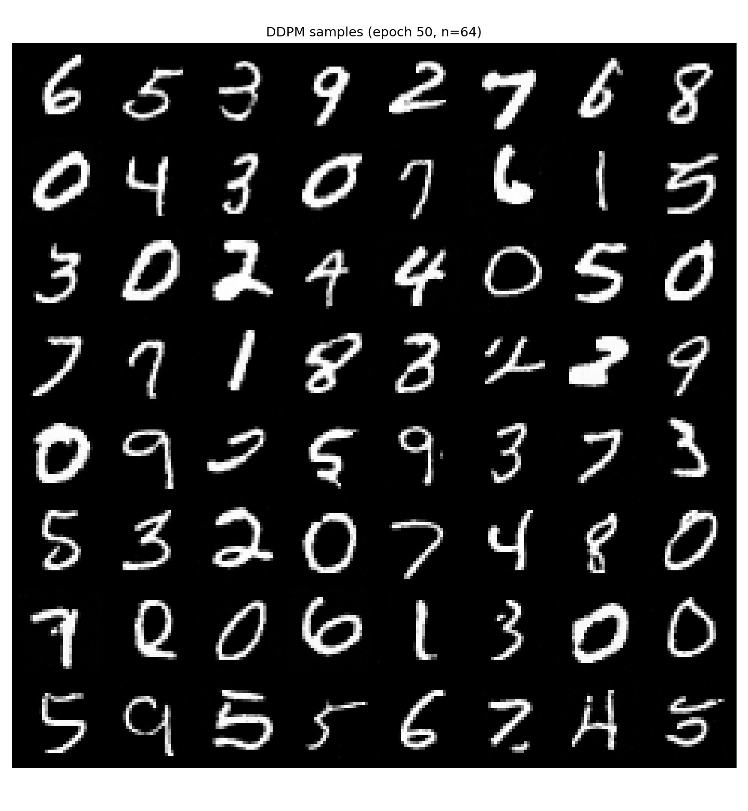
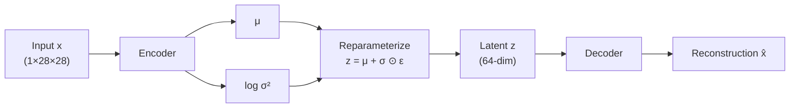
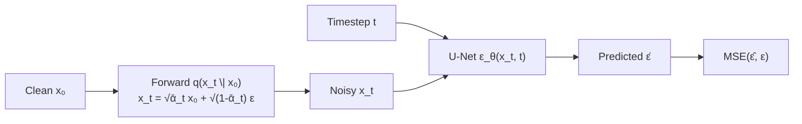

# generative-models

PyTorch implementations of generative models from scratch.

| Model | Dataset | Status |
|-------|---------|--------|
| **VAE** (MLP) | MNIST | Complete — train, sample, interpolate, latent viz |
| **DDPM** (U-Net) | MNIST | Complete — train, reverse sample, epoch progression |

Shared engineering: YAML configs, modular losses/trainers, CSV logs, checkpoint resume, and evaluation scripts.

---

## Table of contents

1. [VAE results](#vae-results-mnist-100-epochs)
2. [DDPM results](#ddpm-results-mnist-50-epochs)
3. [Architecture](#architecture)
4. [Quick start](#quick-start)
5. [Project structure](#project-structure)
6. [Engineering patterns](#engineering-patterns)
7. [Roadmap](#roadmap)

---

## VAE results (MNIST, 100 epochs)

| Setting | Value |
|---------|-------|
| Architecture | MLP encoder / decoder |
| Latent dim | 64 |
| Hidden dim | 512 |
| Loss | BCE (sum) + KL (sum) |
| Optimizer | Adam, lr = 1e-3 |
| Batch size | 128 |

### Training curves


### Test-set reconstructions

Encoder → reparameterization → decoder on held-out digits:


### Random samples

New digits from the prior \(z \sim \mathcal{N}(0, I)\):


### Latent interpolation

Linear interpolation between latent means of digits **3** and **8**:


### Latent space (t-SNE)

2D projection of encoder means \(\mu\) for 3,000 test images:


See also [PCA](docs/assets/vae/latent_space_pca.png) and the [50 vs 100 epoch comparison](docs/assets/vae/epoch_comparison.md).

<details>
<summary><strong>Research note: posterior collapse fix</strong></summary>

Early training used `BCE(reduction="mean")` with `KL = mean(sum(...))`, which made the KL term ~100,000× smaller than expected. The encoder collapsed to \(\mu \approx 0\), \(\sigma \approx 1\) and the decoder ignored the latent code.

**Fix:** switch both terms to **sum reduction**. KL became ~1,000–2,500, reconstructions improved immediately, and random samples became diverse recognizable digits.

</details>

---

## DDPM results (MNIST, 50 epochs)

| Setting | Value |
|---------|-------|
| Architecture | Time-conditioned U-Net (~16.2M params) |
| Timesteps \(T\) | 1000 |
| \(\beta\) schedule | Linear \(10^{-4}\) → \(0.02\) |
| Loss | Noise-prediction MSE (\(L_{\text{simple}}\)) |
| Optimizer | Adam, lr = \(2 \times 10^{-4}\) |
| Batch size | 64 |
| Image range | \([0, 1]\) |

### Training curves



Train/val noise-prediction MSE drops quickly in the first ~10 epochs, then improves slowly through epoch 50.

### Sample quality over training

Digits emerge early; later epochs mainly clean strokes and reduce malformed hybrids.

| Epoch 1 | Epoch 10 |
|---------|----------|
|  |  |

| Epoch 20 | Epoch 50 |
|----------|----------|
|  |  |

---

## Architecture

### VAE



```
Encoder:  784 → 512 → 256 → μ (64), log σ² (64)
Decoder:  64 → 256 → 512 → 784 → Sigmoid → (1×28×28)
Loss:     L = BCE_sum(x̂, x) + KL_sum(q(z|x) ‖ N(0, I))
```

### DDPM



```
Schedule:  β_t linear in [1e-4, 0.02],  α_t = 1−β_t,  ᾱ_t = ∏ α_s
U-Net:     28→14→7 (base 64, mult 1/2/4), attention at 7×7, sinusoidal time emb
Train:     sample t, ε; predict ε̂; minimize ‖ε̂ − ε‖²
Sample:    x_T ~ N(0,I) → iterative reverse steps → x_0
```

---

## Quick start

### Setup

```bash
python -m venv .venv
.venv\Scripts\activate        # Windows
# source .venv/bin/activate   # macOS / Linux

pip install -r requirements.txt
pip install -e ".[dev]"
```

### VAE

```bash
# Train
python scripts/train_vae.py --epochs 1
python scripts/train_vae.py --epochs 50
python scripts/train_vae.py --resume outputs/vae/checkpoints/checkpoint_epoch_050.pt --epochs 100

# Experiments
python scripts/sample_vae.py --checkpoint outputs/vae/checkpoints/vae_epoch100.pt --seed 42
python scripts/reconstruct_vae.py
python scripts/interpolate_vae.py --digit-a 3 --digit-b 8
python scripts/visualize_latent_vae.py --max-samples 3000
python scripts/plot_training_curves.py
python scripts/export_readme_assets.py
```

### DDPM

```bash
# Train
python scripts/train_ddpm.py --epochs 1
python scripts/train_ddpm.py --epochs 50
python scripts/train_ddpm.py --resume outputs/ddpm/checkpoints/latest.pt --epochs 50

# Sample
python scripts/sample_ddpm.py --checkpoint outputs/ddpm/checkpoints/epoch_050.pt --seed 42

# Curves + README assets
python scripts/plot_ddpm_training_curves.py
python scripts/export_ddpm_readme_assets.py
```

Checkpoints are written every epoch as `latest.pt`, plus periodic snapshots `epoch_005.pt`, `epoch_010.pt`, … (`checkpoint_every` in the YAML).

On Colab, override `checkpoint_dir` / `sample_dir` / `log_dir` in `configs/ddpm/mnist.yaml` to a Drive path, or pass an absolute `--checkpoint` when sampling.

### Tests

```bash
pytest
```

---

## Project structure

```
generative-models/
├── configs/
│   ├── vae/mnist.yaml
│   └── ddpm/mnist.yaml
├── docs/assets/
│   ├── vae/                 # Tracked README figures
│   └── ddpm/                # Tracked README figures
├── outputs/                 # Checkpoints, logs, samples (gitignored)
├── scripts/                 # CLI entry points
└── src/generative_models/
    ├── datasets/            # MNIST loaders
    ├── models/              # VAE
    ├── ddpm/                # Scheduler, U-Net, DDPM, sampler
    ├── losses/              # VAELoss, DDPMLoss
    ├── trainers/            # VAETrainer, DDPMTrainer
    ├── evaluation/          # VAE evaluation helpers
    └── utils/               # Device helpers
```

---

## Engineering patterns

| Pattern | VAE | DDPM |
|---------|-----|------|
| Config | `configs/vae/mnist.yaml` | `configs/ddpm/mnist.yaml` |
| Model | `models/vae.py` | `ddpm/{scheduler,unet,diffusion}.py` |
| Loss | `losses/vae_loss.py` | `losses/ddpm_loss.py` |
| Trainer | `trainers/vae_trainer.py` | `trainers/ddpm_trainer.py` |
| Sample | `scripts/sample_vae.py` | `scripts/sample_ddpm.py` |
| Logs / ckpts | `outputs/vae/` | `outputs/ddpm/` |

---

## Roadmap

**VAE**

- [x] Dataset, encoder/decoder, ELBO loss, trainer
- [x] Logging, checkpointing, sampling
- [x] Reconstruction, interpolation, latent visualization
- [x] 50 vs 100 epoch comparison

**DDPM**

- [x] Noise schedule and forward diffusion
- [x] Time embedding and U-Net
- [x] Noise-prediction loss and trainer
- [x] Reverse sampling and 1 → 50 epoch results

---

## License

See [LICENSE](LICENSE).
